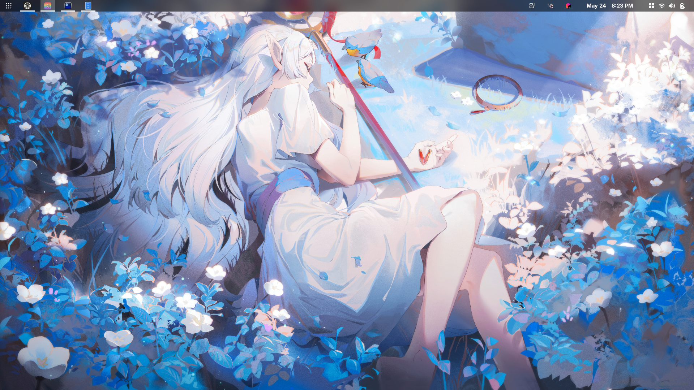
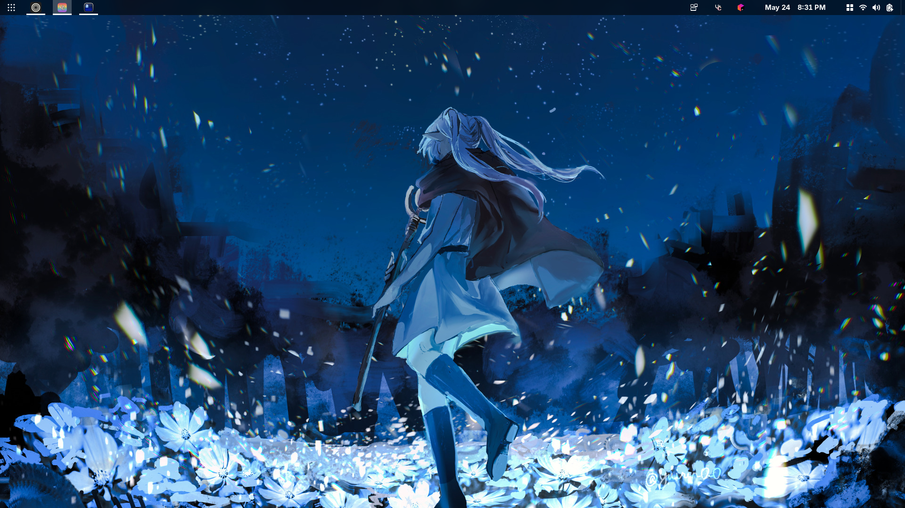

[](https://github.com/Ariffansyah/orb-os/actions/workflows/build.yml)
# Orb OS
Orb OS is a Linux-based operating system designed with developers in mind. Built for speed, simplicity, and productivity, Orb OS comes pre-configured with essential development tools, libraries, and environments—ready to use straight after installation. Whether you're coding in Python, JavaScript, C++, or exploring web and backend development, Orb OS offers a streamlined, bloat-free experience that empowers you to focus on building, not configuring.
## Key Features
- **Lightweight and Fast**: Orb OS is designed to be lightweight, ensuring quick boot times and efficient resource usage.
- **Developer-Centric**: Pre-installed with essential development tools, libraries, and environments.
- **Customizable**: Easily customize your environment to suit your workflow.

### Installation
1. Download the [Orb OS ISO](https://github.com/Ariffansyah/orb-os/actions/workflows/build-iso.yml) (choose the latest workflow and then download the artifact).
2. Create a bootable USB drive using tools like Rufus or Etcher.
3. Boot from the USB drive and follow the on-screen instructions to install Orb OS.
4. Once installed, log in and start coding!

### Rebase from existing upstream Fedora Atomic
```
rpm-ostree rebase ostree-unverified-registry:ghcr.io/ariffnasyah/orb-os:latest
```

## Gnome Desktop Environment Extensions
- **Dash to Panel**
- **VShell**
- **Forge**
- **Media Controls**

after installing the operating system, you can install the extensions using the following command:
```
ujust install
```
and then restart the gnome shell by pressing `Alt + F2` and typing `r` and pressing enter. or you can reboot the system, then run the following command:
```
ujust enable
```
if the extensions is not installed, you can install it manually or reboot and try again.

## (Optional) neovim, ghostty, tmux, zsh, and starship configuration
You can install the optional configuration for neovim, ghostty, tmux, zsh, and starship by running the following command:
```
ujust setup-dev-env
```
the config base on [dotfiles](https://github.com/Ariffansyah/dotfiles) and [neovim](https://github.com/Ariffansyah/unemployee.nvim).

## Preview

<div align="center"><table><tr>Light or Dark</tr><tr><td>
</td><td>
</td></tr></table></div>
